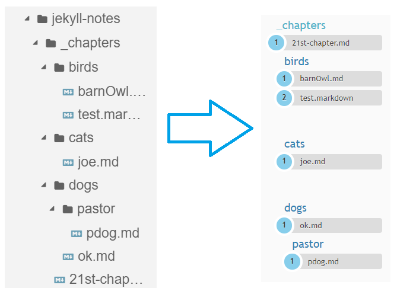

## Jekyll-notes

Jekyll-notes is a Jekyll theme for managing notes.  
Simply create _chapters folder and populate it with subfolders and notes.  
The .md files with "layout: default" would appear at Notes page submenu.

## Screenshot




## Installing

### Using gem

Gemfile
```yaml
gem "jekyll-notes"
```

_config.yml
```yaml
theme: jekyll-notes

collections:
        sections:
                output: false
        chapters:
                output: true
```

Run `bundle install`  

Create _chapters folder and make .md files inside.

```yaml
---
layout: default
---
```

Change index.markdown from `layout: home` to `layout: default`

## Installing using jekyll-remote-theme

1. Edit Gemfile 
```yaml
group :jekyll_plugins do
  gem "jekyll-remote-theme"
end
```

2. Edit _config.yml  
```yaml
plugins:
  - jekyll-remote-theme

remote_theme: alexz005/jekyll-notes

collections:
        sections:
                output: false
        chapters:
                output: true
```

3. Create _chapters folder and make .md files inside.

## Debugging locally

Gemfile
```yaml
group :jekyll_plugins do
  gem "jekyll-feed", "~> 0.12"
  gem "jekyll-notes", :path => "../../jekyll-notes/"
end
```

_config.yml
```yaml
theme: jekyll-notes
collections:
        sections:
                output: false
        chapters:
                output: true
```

## Advantages

Contents are stored in _chapters folder and any subfolder and its files are automatically seen in submenu. The notes have to mantain yaml structure though, including three dashes and layout: default.

Menu automatically generates with subfolders, isn’t it neat?


## Building and testing locally

This site is using Jekyll/SCSS  
bundle exec jekyll serve --port 8080

## Used sources

Following were used to build this theme:  

1. Parts of theme [Milidocs](http://alexander.heimbu.ch/millidocs/) by Alexander Heimbuch
2. Collapsable list Javascript code from [here](http://code.iamkate.com/javascript/collapsible-lists/) by Kate Morley
3. JavaScript code to generate menu from [here](https://stackoverflow.com/questions/26645220/build-nested-folder-structure-from-path-strings/26652662)
4. JavaScript code to search through the list from [here](https://www.w3schools.com/howto/howto_js_filter_lists.asp)
5. Parts of [startbootstrap](https://github.com/BlackrockDigital/startbootstrap-landing-page)

## License

MIT license, except any copied code or parts used above.

Have you found it useful? Give me a star or [fork](/fork) this!
